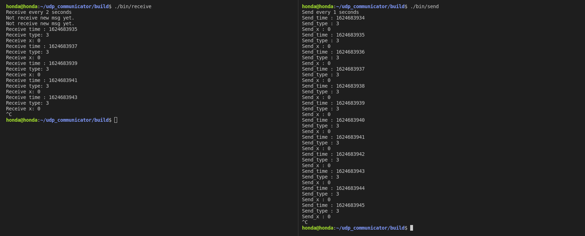

# Simple Non-Blocking UDP Library

A header only C++ non-blocking UDP socket library for Windows/Linux.

Get only latest message when received.

## Example

#### Message definition
```c++
#include <ctime>

struct msg_A
{
    std::time_t time;
    double x = 0.0;
    double y = 0.0;
    double z = 0.0;
    int type = 0;
};
```

#### Sender example

```c++
#include "udp_lib_switcher.hpp"
#include "msg_A.hpp"

int main()
{
	udp::UDPLib<msg_A> server("127.0.0.1", 5555);
	msg_A msg;

	msg.x = 0;
	msg.y = 30;
	msg.z = 40;
	msg.type = 3;

	server.udp_send(msg);

	return 0;
}
```

#### Receiver exapmple

```c++
#include "udp_lib_switcher.hpp"
#include "msg_A.hpp"

int main()
{
	udp::UDPLib<msg_A> client("127.0.0.1", 5555);
	client.udp_bind();
	msg_A msg;

	if (client.udp_receive(&msg))
	{
		std::cout << "Receive_time : " << msg.time << std::endl;
		std::cout << "Receive_type: " << msg.type << std::endl;
		std::cout << "Receive_x: " << msg.x << std::endl;
	}
	else
	{
		std::cout << "Not receive new msg yet." << std::endl;
	}

	return 0;
}
```

## How to test example

### Linux
#### 1. Build
```bash
cd udp_communicator
mkdir build
cd build
cmake ..
make
```
#### 2. Run
```bash
cd build
./bin/receive
```
On another terminal
```bash
cd build
./bin/send
```

### Windows with MSBuild
#### 1. Build
```bash
cd udp_communicator
mkdir build
cd build
cmake ..
MSBuild.exe .\ALL_BUILD.vcxproj
```

#### 2. Run
```bash
./bin/Release/receive.exe
```
On another terminal
```bash
./bin/Release/send.exe
```

